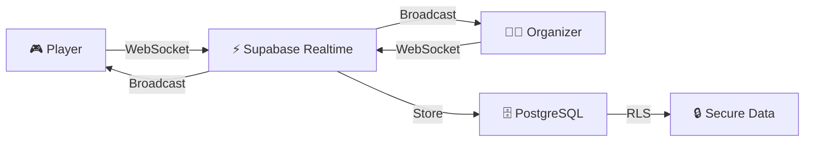
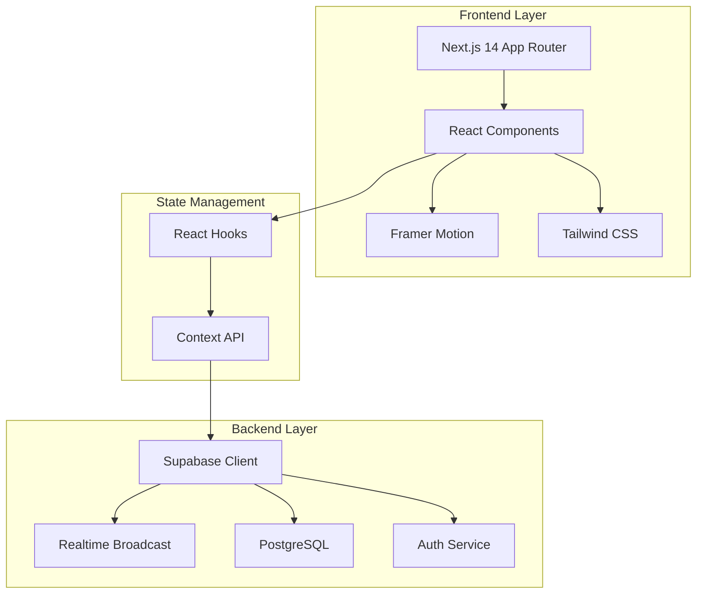

<div align="center">

# 🎮 Qubit

### _Interactive Real-Time Quiz Platform That Brings Learning to Life_

[](https://nextjs.org)
[](https://www.typescriptlang.org)
[](https://tailwindcss.com)
[](https://supabase.com)
[](https://www.framer.com/motion)

[](LICENSE)
[](CONTRIBUTING.md)
[](https://github.com/yourusername/qubit)

[🚀 Live Demo](#) • [📖 Documentation](#-table-of-contents) • [🐛 Report Bug](https://github.com/yourusername/qubit/issues) • [✨ Request Feature](https://github.com/yourusername/qubit/issues)

</div>

---

## 📑 Table of Contents

- [🌟 Overview](#-overview)
- [✨ Key Features](#-key-features)
- [🎬 Demo & Screenshots](#-demo--screenshots)
- [🏗️ Architecture](#️-architecture)
- [🚀 Quick Start](#-quick-start)
- [⚙️ Detailed Setup](#️-detailed-setup)
- [📱 Usage Guide](#-usage-guide)
- [🎨 Design System](#-design-system)
- [🔧 Development](#-development)
- [🧪 Testing](#-testing)
- [📊 Performance](#-performance)
- [🗺️ Roadmap](#️-roadmap)
- [🤝 Contributing](#-contributing)
- [❓ FAQ & Troubleshooting](#-faq--troubleshooting)
- [📄 License](#-license)
- [🙏 Acknowledgments](#-acknowledgments)

---

## 🌟 Overview

**Qubit** is a next-generation, real-time quiz platform designed to revolutionize interactive learning and engagement. Inspired by Kahoot!, Qubit takes the concept further with cutting-edge technology, stunning animations, and a seamless user experience that works flawlessly across all devices.

### 🎯 Why Qubit?

> **"Education meets entertainment in real-time"**

- **🚀 Zero Latency**: Experience true real-time interactions with Supabase Realtime Broadcast
- **🎨 Stunning Visuals**: Every interaction is a delight with Framer Motion animations
- **📱 Universal Access**: From smartphones to projectors, Qubit adapts beautifully
- **🔒 Privacy First**: No player accounts needed - just join and play
- **⚡ Lightning Fast**: Optimized for performance with Next.js 14 App Router

---

## ✨ Key Features

<table>
<tr>
<td width="50%">

### 🎮 For Players

- ✅ **No Registration Required** - Join with just a PIN
- 🎭 **Customizable Avatars** - Unique DiceBear avatars
- ⚡ **Real-Time Gameplay** - Instant feedback and updates
- 🏆 **Live Leaderboards** - See rankings update in real-time
- 📱 **Mobile Optimized** - Play on any device
- 🎯 **Speed Matters** - Faster answers = more points
- 🎉 **Engaging Animations** - Confetti, shakes, and more

</td>
<td width="50%">

### 👨‍🏫 For Organizers

- 🔐 **Secure Authentication** - Supabase Auth with RLS
- 📝 **Easy Quiz Creation** - Intuitive question builder
- 🎛️ **Full Game Control** - Manage sessions in real-time
- 📊 **Analytics Dashboard** - Track player performance
- 🖥️ **Projector Mode** - Optimized for large displays
- 💾 **Auto-Save** - Never lose your work
- 🔄 **Reusable Quizzes** - Create once, use many times

</td>
</tr>
</table>

### 🌟 Technical Highlights



- **🔥 Real-Time Engine**: Supabase Realtime Broadcast (WebSocket-based, NO polling)
- **👥 Scalable**: Support for 100+ simultaneous players per session
- **🎨 Smooth Animations**: 60 FPS animations with Framer Motion
- **📱 Responsive Design**: Mobile-first with breakpoints for all screen sizes
- **🔐 Security**: Row Level Security (RLS) policies for data protection
- **⚡ Performance**: Optimized bundle size and lazy loading
- **♿ Accessible**: WCAG 2.1 compliant with keyboard navigation

---

## 🎬 Demo & Screenshots

### 🎥 Live Demo

> **[Try Qubit Now →](#)** _(Coming Soon)_

### 📸 Screenshots

<details>
<summary>🖼️ Click to view screenshots</summary>

#### Landing Page

_Modern, engaging landing page with clear call-to-action_

#### Quiz Creation

_Intuitive interface for creating questions with multiple choice options_

#### Player Lobby

_Real-time lobby showing players joining with their avatars_

#### Live Gameplay

_Interactive question screen with countdown timer_

#### Leaderboard

_Animated leaderboard showing top performers_

#### Results

_Comprehensive results page with statistics_

</details>

---

## 🏗️ Architecture

### 📐 System Architecture



### 📁 Project Structure

```
qubit/
├── 📱 app/                          # Next.js App Router
│   ├── 🔐 (admin)/                 # Protected admin routes
│   │   ├── dashboard/              # Admin dashboard
│   │   │   └── page.tsx
│   │   └── quiz/                   # Quiz management
│   │       ├── create/             # Create new quiz
│   │       ├── edit/[id]/          # Edit existing quiz
│   │       └── live/[sessionId]/   # Live game control
│   ├── 🎮 (player)/                # Public player routes
│   │   ├── join/                   # Join game with PIN
│   │   ├── lobby/[sessionId]/      # Pre-game lobby
│   │   ├── play/[sessionId]/       # Active gameplay
│   │   └── results/[sessionId]/    # Post-game results
│   ├── 🔑 auth/                    # Authentication
│   │   ├── login/                  # Login page
│   │   └── signup/                 # Signup page
│   ├── layout.tsx                  # Root layout
│   ├── page.tsx                    # Landing page
│   └── globals.css                 # Global styles
│
├── 🧩 components/                   # React components
│   ├── admin/                      # Admin-specific components
│   │   ├── QuizBuilder.tsx         # Quiz creation interface
│   │   ├── GameControl.tsx         # Live game controls
│   │   └── QuizCard.tsx            # Quiz preview card
│   ├── player/                     # Player-specific components
│   │   ├── AvatarSelector.tsx      # Avatar selection
│   │   ├── QuestionCard.tsx        # Question display
│   │   └── Leaderboard.tsx         # Leaderboard display
│   ├── shared/                     # Shared components
│   │   ├── Header.tsx              # App header
│   │   ├── Footer.tsx              # App footer
│   │   └── LoadingSpinner.tsx      # Loading states
│   └── ui/                         # Base UI components
│       ├── Button.tsx              # Custom button
│       ├── Input.tsx               # Custom input
│       └── Card.tsx                # Card container
│
├── 📚 lib/                          # Core libraries
│   ├── supabase/                   # Supabase configuration
│   │   ├── client.ts               # Browser client
│   │   ├── server.ts               # Server client
│   │   └── middleware.ts           # Auth middleware
│   ├── hooks/                      # Custom React hooks
│   │   ├── useGameSession.ts       # Game session hook
│   │   ├── useRealtime.ts          # Realtime hook
│   │   └── useAuth.ts              # Authentication hook
│   ├── utils/                      # Utility functions
│   │   ├── scoring.ts              # Scoring algorithm
│   │   ├── validation.ts           # Input validation
│   │   └── formatters.ts           # Data formatters
│   └── types/                      # TypeScript definitions
│       ├── database.ts             # Database types
│       └── game.ts                 # Game types
│
├── 🗄️ supabase/                    # Supabase configuration
│   ├── migrations/                 # Database migrations
│   │   └── 001_initial_schema.sql  # Initial schema
│   └── config.toml                 # Supabase config
│
├── 🎨 public/                       # Static assets
│   ├── images/                     # Image files
│   ├── icons/                      # Icon files
│   └── favicon.ico                 # Favicon
│
├── 📝 docs/                         # Documentation
│   ├── API.md                      # API documentation
│   ├── DEPLOYMENT.md               # Deployment guide
│   └── CONTRIBUTING.md             # Contribution guide
│
└── ⚙️ Configuration Files
    ├── .env.local.example          # Environment template
    ├── next.config.js              # Next.js config
    ├── tailwind.config.ts          # Tailwind config
    ├── tsconfig.json               # TypeScript config
    └── package.json                # Dependencies
```

### 🗄️ Database Schema

<details>
<summary>📊 Click to view database schema</summary>

```sql
-- Core Tables
profiles          # User profiles (organizers)
quizzes           # Quiz definitions
questions         # Quiz questions
game_sessions     # Active game sessions
players           # Player data
player_answers    # Answer submissions
leaderboard       # Calculated scores

-- Relationships
quizzes → questions (1:many)
quizzes → game_sessions (1:many)
game_sessions → players (1:many)
players → player_answers (1:many)
```

</details>

---

## 🚀 Quick Start

Get Qubit running in **5 minutes**:

```bash
# 1️⃣ Clone the repository
git clone https://github.com/yourusername/qubit.git
cd qubit

# 2️⃣ Install dependencies
npm install

# 3️⃣ Set up environment variables
cp .env.local.example .env.local
# Edit .env.local with your Supabase credentials

# 4️⃣ Run database migrations
# (See Detailed Setup section)

# 5️⃣ Start development server
npm run dev
```

**🎉 That's it!** Open [http://localhost:3000](http://localhost:3000)

> **⚠️ Important**: You'll need a Supabase account. [Sign up for free →](https://supabase.com)

---

## ⚙️ Detailed Setup

### 📋 Prerequisites

Before you begin, ensure you have:

- ✅ **Node.js** 18.0 or higher ([Download](https://nodejs.org))
- ✅ **npm** 9.0 or higher (comes with Node.js)
- ✅ **Git** ([Download](https://git-scm.com))
- ✅ **Supabase Account** ([Sign up](https://supabase.com))
- ✅ **Modern Browser** (Chrome, Firefox, Safari, Edge)

### 🔧 Step-by-Step Installation

#### 1️⃣ Clone the Repository

```bash
# Using HTTPS
git clone https://github.com/yourusername/qubit.git

# Or using SSH
git clone git@github.com:yourusername/qubit.git

# Navigate to project directory
cd qubit
```

#### 2️⃣ Install Dependencies

```bash
npm install
```

<details>
<summary>📦 View installed packages</summary>

**Core Dependencies:**

- `next` - React framework
- `react` & `react-dom` - React library
- `typescript` - Type safety
- `@supabase/supabase-js` - Supabase client
- `framer-motion` - Animations
- `tailwindcss` - Styling
- `lucide-react` - Icons

</details>

#### 3️⃣ Set Up Supabase

##### Create a New Project

1. Go to [supabase.com](https://supabase.com)
2. Click **"New Project"**
3. Fill in project details:
   - **Name**: `qubit-production`
   - **Database Password**: _Generate a strong password_
   - **Region**: _Choose closest to your users_
4. Click **"Create new project"** and wait for provisioning

##### Get API Credentials

1. Navigate to **Project Settings** → **API**
2. Copy the following:
   - **Project URL**: `https://xxxxx.supabase.co`
   - **anon/public key**: `eyJhbGciOiJIUzI1NiIsInR5cCI6IkpXVCJ9...`

##### Run Database Migration

1. Go to **SQL Editor** in your Supabase dashboard
2. Click **"New Query"**
3. Copy the entire contents of `supabase/migrations/001_initial_schema.sql`
4. Paste into the editor
5. Click **"Run"** or press `Ctrl+Enter`
6. Verify success message: _"Success. No rows returned"_

<details>
<summary>🗄️ What does the migration create?</summary>

The migration sets up:

- ✅ User profiles table with RLS policies
- ✅ Quizzes and questions tables
- ✅ Game sessions and players tables
- ✅ Leaderboard and answers tables
- ✅ Database functions for scoring
- ✅ Triggers for real-time updates

</details>

##### Enable Realtime

1. Go to **Database** → **Replication**
2. Find `game_sessions` table and toggle **"Realtime"** to ON
3. Find `players` table and toggle **"Realtime"** to ON
4. Find `player_answers` table and toggle **"Realtime"** to ON

> **💡 Tip**: Realtime enables WebSocket-based updates for instant synchronization

#### 4️⃣ Configure Environment Variables

```bash
# Copy the example file
cp .env.local.example .env.local
```

Edit `.env.local` with your credentials:

```env
# Supabase Configuration
NEXT_PUBLIC_SUPABASE_URL=https://your-project.supabase.co
NEXT_PUBLIC_SUPABASE_ANON_KEY=your-anon-key-here

# Optional: Analytics (if using)
# NEXT_PUBLIC_GA_ID=G-XXXXXXXXXX

# Optional: Custom Domain
# NEXT_PUBLIC_APP_URL=https://qubit.yourdomain.com
```

> **🔒 Security Note**: Never commit `.env.local` to version control!

#### 5️⃣ Verify Installation

```bash
# Run type checking
npm run type-check

# Run linting
npm run lint

# Start development server
npm run dev
```

**✅ Success Indicators:**

- No TypeScript errors
- No linting errors
- Server running on `http://localhost:3000`
- No console errors in browser

---

## 📱 Usage Guide

### 👨‍🏫 For Organizers

#### Creating Your First Quiz

1. **Sign Up**

   - Navigate to `/auth/signup`
   - Enter your email and password
   - Verify your email (check spam folder)
   - Login at `/auth/login`

2. **Create a Quiz**

   - Click **"Create Quiz"** from dashboard
   - Enter quiz title and description
   - Add questions (minimum 3 recommended)
   - For each question:
     - ✍️ Write the question text
     - ➕ Add 2-4 answer options
     - ✅ Mark the correct answer(s)
     - ⏱️ Set time limit (5-60 seconds)
   - Click **"Save Quiz"**

3. **Start a Game Session**

   - Go to **"My Quizzes"**
   - Click **"Start Game"** on your quiz
   - A 6-digit PIN will be generated
   - Share the PIN with players
   - Display the lobby on a projector/screen

4. **Control the Game**
   - Wait for players to join
   - Click **"Start Game"** when ready
   - Advance through questions with **"Next"**
   - View live responses and leaderboard
   - End game to show final results

#### Pro Tips for Organizers

- 🎯 **Question Design**: Keep questions concise and clear
- ⏱️ **Timing**: 15-20 seconds works best for most questions
- 🎨 **Variety**: Mix easy and challenging questions
- 📊 **Review**: Check analytics after each session
- 💾 **Reuse**: Save successful quizzes for future use

### 🎮 For Players

#### Joining a Game

1. **Get the PIN**

   - Organizer will share a 6-digit PIN
   - Example: `123456`

2. **Join the Game**

   - Go to `/join` or click **"Join Game"**
   - Enter the PIN
   - Click **"Join"**

3. **Choose Your Identity**

   - Enter your nickname (3-20 characters)
   - Select an avatar or randomize
   - Click **"Enter Lobby"**

4. **Wait in Lobby**

   - See other players joining in real-time
   - Wait for organizer to start the game
   - Get ready! 🎮

5. **Play the Game**

   - Read each question carefully
   - Select your answer quickly (faster = more points!)
   - See if you're correct immediately
   - Check your ranking on the leaderboard
   - Repeat for all questions

6. **View Results**
   - See your final score and ranking
   - Compare with other players
   - Celebrate if you're on the podium! 🏆

#### Pro Tips for Players

- ⚡ **Speed Matters**: Faster correct answers earn more points
- 🎯 **Accuracy First**: Wrong answers give 0 points
- 📱 **Stable Connection**: Use WiFi for best experience
- 🔋 **Battery**: Ensure your device is charged
- 🤔 **Think Fast**: Don't overthink simple questions

---

## 🎨 Design System

### 🎨 Color Palette

```css
/* Primary Colors */
--primary: #6366f1; /* Indigo - Main brand color */
--primary-dark: #4f46e5; /* Darker indigo for hover states */
--primary-light: #818cf8; /* Lighter indigo for backgrounds */

/* Semantic Colors */
--success: #10b981; /* Green - Correct answers */
--error: #ef4444; /* Red - Wrong answers */
--warning: #f59e0b; /* Amber - Warnings */
--info: #3b82f6; /* Blue - Information */

/* Neutral Colors */
--gray-50: #f9fafb;
--gray-100: #f3f4f6;
--gray-900: #111827;

/* Game Colors */
--answer-a: #e74c3c; /* Red */
--answer-b: #3498db; /* Blue */
--answer-c: #f39c12; /* Orange */
--answer-d: #2ecc71; /* Green */
```

### 📐 Responsive Breakpoints

```javascript
// Tailwind CSS breakpoints
{
  'sm': '640px',   // Mobile landscape
  'md': '768px',   // Tablet
  'lg': '1024px',  // Desktop
  'xl': '1280px',  // Large desktop
  '2xl': '1536px'  // Projector/TV
}
```

### ✨ Animation Principles

- **Duration**: 200-300ms for micro-interactions
- **Easing**: `ease-out` for entrances, `ease-in` for exits
- **Purpose**: Every animation serves a functional purpose
- **Performance**: GPU-accelerated transforms only

---

## 🔧 Development

### 🛠️ Available Scripts

```bash
# Development
npm run dev          # Start development server (port 3000)
npm run dev:turbo    # Start with Turbopack (faster)

# Building
npm run build        # Create production build
npm run start        # Run production build locally

# Code Quality
npm run lint         # Run ESLint
npm run lint:fix     # Fix ESLint errors
npm run type-check   # Run TypeScript compiler
npm run format       # Format code with Prettier

# Database
npm run db:migrate   # Run Supabase migrations
npm run db:reset     # Reset database (⚠️ destructive)
npm run db:seed      # Seed database with sample data
```

### 🔍 Code Quality Tools

- **ESLint**: Enforces code style and catches errors
- **TypeScript**: Provides type safety
- **Prettier**: Ensures consistent formatting
- **Husky**: Pre-commit hooks for quality checks

### 🌿 Git Workflow

```bash
# Create a feature branch
git checkout -b feature/your-feature-name

# Make changes and commit
git add .
git commit -m "feat: add amazing feature"

# Push to remote
git push origin feature/your-feature-name

# Create pull request on GitHub
```

#### Commit Message Convention

Follow [Conventional Commits](https://www.conventionalcommits.org):

- `feat:` New feature
- `fix:` Bug fix
- `docs:` Documentation changes
- `style:` Code style changes (formatting)
- `refactor:` Code refactoring
- `test:` Adding tests
- `chore:` Maintenance tasks

---

## 🧪 Testing

### 🧪 Testing Strategy

```bash
# Run all tests
npm test

# Run tests in watch mode
npm run test:watch

# Run tests with coverage
npm run test:coverage

# Run E2E tests
npm run test:e2e
```

<details>
<summary>📊 View testing coverage goals</summary>

- **Unit Tests**: 80%+ coverage
- **Integration Tests**: Critical user flows
- **E2E Tests**: Complete game sessions

</details>

---

## 📊 Performance

### ⚡ Performance Metrics

Qubit is optimized for speed:

- 🎯 **Lighthouse Score**: 95+ (Performance)
- ⚡ **First Contentful Paint**: < 1.5s
- 🎨 **Largest Contentful Paint**: < 2.5s
- 📱 **Time to Interactive**: < 3.5s
- 🔄 **Realtime Latency**: < 100ms

### 🚀 Optimization Techniques

- ✅ Next.js App Router with automatic code splitting
- ✅ Image optimization with `next/image`
- ✅ Lazy loading for non-critical components
- ✅ WebSocket connections for real-time data
- ✅ Optimistic UI updates
- ✅ Efficient re-rendering with React.memo
- ✅ Tailwind CSS purging for minimal CSS

---

## 🗺️ Roadmap

### 🎯 Version 1.0 (Current)

- [x] Real-time multiplayer gameplay
- [x] Quiz creation and management
- [x] Player authentication (PIN-based)
- [x] Organizer authentication (Supabase Auth)
- [x] Live leaderboards
- [x] Responsive design
- [x] Avatar system

### 🚀 Version 1.1 (Q2 2026)

- [ ] **Quiz Templates** - Pre-built quiz categories
- [ ] **Image Support** - Add images to questions
- [ ] **Sound Effects** - Audio feedback for interactions
- [ ] **Export Results** - Download results as CSV/PDF
- [ ] **Custom Branding** - Personalize quiz appearance
- [ ] **Analytics Dashboard** - Detailed performance metrics

### 🌟 Version 2.0 (Q3 2026)

- [ ] **Team Mode** - Collaborative gameplay
- [ ] **Video Questions** - Embed video content
- [ ] **Background Music** - Customizable audio tracks
- [ ] **Mobile Apps** - Native iOS and Android apps
- [ ] **AI Question Generator** - Auto-generate questions
- [ ] **Multi-language Support** - Internationalization

### 🔮 Future Ideas

- [ ] Integration with LMS platforms (Moodle, Canvas)
- [ ] Gamification with badges and achievements
- [ ] Tournament mode with brackets
- [ ] Live streaming integration
- [ ] Accessibility enhancements (screen reader support)

---

## 🤝 Contributing

We love contributions! 🎉

### 🌟 How to Contribute

1. **Fork** the repository
2. **Create** a feature branch (`git checkout -b feature/AmazingFeature`)
3. **Commit** your changes (`git commit -m 'feat: add amazing feature'`)
4. **Push** to the branch (`git push origin feature/AmazingFeature`)
5. **Open** a Pull Request

### 📜 Contribution Guidelines

- ✅ Follow the existing code style
- ✅ Write meaningful commit messages
- ✅ Add tests for new features
- ✅ Update documentation as needed
- ✅ Ensure all tests pass before submitting

### 🐛 Reporting Bugs

Found a bug? [Open an issue](https://github.com/yourusername/qubit/issues) with:

- 📝 Clear description of the problem
- 🔄 Steps to reproduce
- 💻 Expected vs actual behavior
- 🖼️ Screenshots (if applicable)
- 🌐 Browser and OS information

---

## ❓ FAQ & Troubleshooting

<details>
<summary><strong>❓ The game PIN doesn't work</strong></summary>

**Solution:**

- Ensure the game session is active
- Check that you're entering the correct 6-digit PIN
- Try refreshing the page
- Verify your internet connection

</details>

<details>
<summary><strong>❓ Players aren't seeing real-time updates</strong></summary>

**Solution:**

- Verify Realtime is enabled in Supabase (Database → Replication)
- Check browser console for WebSocket errors
- Ensure firewall isn't blocking WebSocket connections
- Try using a different network

</details>

<details>
<summary><strong>❓ Build fails with TypeScript errors</strong></summary>

**Solution:**

```bash
# Clear Next.js cache
rm -rf .next

# Reinstall dependencies
rm -rf node_modules package-lock.json
npm install

# Run type check
npm run type-check
```

</details>

<details>
<summary><strong>❓ Environment variables not loading</strong></summary>

**Solution:**

- Ensure `.env.local` exists in root directory
- Verify variable names start with `NEXT_PUBLIC_`
- Restart the development server after changes
- Check for typos in variable names

</details>

<details>
<summary><strong>❓ Supabase connection errors</strong></summary>

**Solution:**

- Verify Supabase URL and anon key in `.env.local`
- Check Supabase project status (not paused)
- Ensure RLS policies are correctly configured
- Test connection in Supabase dashboard

</details>

<details>
<summary><strong>❓ How do I deploy to production?</strong></summary>

**Recommended Platforms:**

- **Vercel** (Easiest): [Deploy Guide](https://vercel.com/docs)
- **Netlify**: [Deploy Guide](https://docs.netlify.com)
- **Self-hosted**: Use `npm run build` and `npm start`

**Steps:**

1. Push code to GitHub
2. Connect repository to hosting platform
3. Add environment variables
4. Deploy!

</details>

### 💬 Need More Help?

- 📚 [Full Documentation](docs/)
- 💬 [Discord Community](#)
- 📧 [Email Support](mailto:support@qubit.dev)
- 🐛 [GitHub Issues](https://github.com/yourusername/qubit/issues)

---

## 📄 License

This project is licensed under the **MIT License** - see the [LICENSE](LICENSE) file for details.

**TL;DR**: You can use, modify, and distribute this project freely, even for commercial purposes. Just include the original license and copyright notice.

---

## 🙏 Acknowledgments

### 🌟 Inspiration

- **[Kahoot!](https://kahoot.com)** - The original interactive quiz platform that inspired this project

### 🛠️ Built With

- **[Next.js](https://nextjs.org)** - The React framework for production
- **[Supabase](https://supabase.com)** - Open source Firebase alternative
- **[Tailwind CSS](https://tailwindcss.com)** - Utility-first CSS framework
- **[Framer Motion](https://www.framer.com/motion)** - Production-ready animation library
- **[Lucide](https://lucide.dev)** - Beautiful & consistent icon toolkit
- **[DiceBear](https://dicebear.com)** - Avatar library for designers and developers

### 👏 Special Thanks

- All contributors who have helped improve Qubit
- The open-source community for amazing tools and libraries
- Early testers and users for valuable feedback

---

<div align="center">

### 🌟 Star this repo if you find it helpful!

[](https://github.com/yourusername/qubit/stargazers)
[](https://github.com/yourusername/qubit/network/members)

**Made with ❤️ and ☕ by the Qubit Team**

[⬆ Back to Top](#-qubit)

</div>
